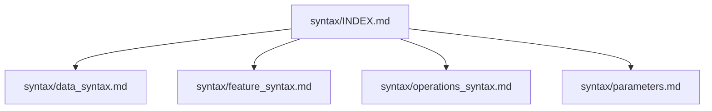

# Syntax Index

File này là điểm vào chính cho toàn bộ thư mục `syntax/`.

## Reading Map

## Read Order

1. Đọc `syntax/data_syntax.md` để chọn đúng field dữ liệu.
2. Đọc `syntax/feature_syntax.md` để chọn đúng hàm `self.feat.*`.
3. Đọc `syntax/operations_syntax.md` để chọn đúng toán tử `self.op.*`.
4. Đọc `syntax/parameters.md` khi cần bộ tham số chuẩn cho khung 15m.

## When To Use

| Need | Read first |
|---|---|
| Chọn nguồn dữ liệu | `syntax/data_syntax.md` |
| Chọn indicator / feature | `syntax/feature_syntax.md` |
| Chọn operator / causal helper | `syntax/operations_syntax.md` |
| Chọn parameter chuẩn 15m | `syntax/parameters.md` |

## Common Use Cases

| Use case | Suggested path |
|---|---|
| Trend following | `feature_syntax.md` -> `operations_syntax.md` |
| Mean reversion | `feature_syntax.md` -> `operations_syntax.md` -> `parameters.md` |
| Breakout | `data_syntax.md` -> `feature_syntax.md` -> `parameters.md` |
| Flow / participation | `data_syntax.md` -> `feature_syntax.md` |
| Intraday session | `data_syntax.md` -> `operations_syntax.md` -> `parameters.md` |

## Rules

- `syntax/INDEX.md` chỉ hướng dẫn cách đọc.
- `syntax/data_syntax.md`, `syntax/feature_syntax.md`, `syntax/operations_syntax.md` là catalog tra cứu.
- `syntax/parameters.md` chỉ chứa bộ tham số chuẩn cho khung 15m.
- Khi generate code, ưu tiên đọc INDEX trước, rồi mới rẽ sang catalog chi tiết.

