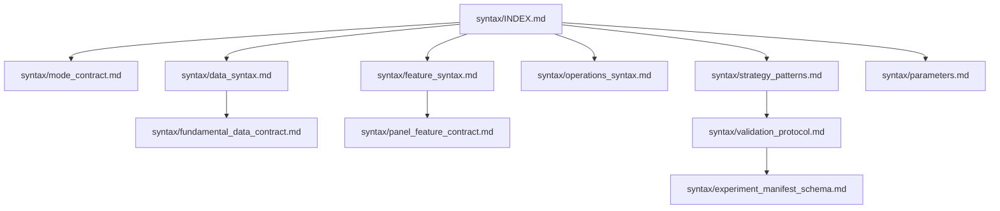

# Syntax Index

File này là điểm vào chính cho toàn bộ thư mục `syntax/`.

## Reading Map

```mermaid
flowchart TD
    A["syntax/INDEX.md"] --> M["syntax/mode_contract.md"]
    A --> B["syntax/data_syntax.md"]
    B --> F["syntax/fundamental_data_contract.md"]
    A --> C["syntax/feature_syntax.md"]
    C --> P["syntax/panel_feature_contract.md"]
    A --> D["syntax/operations_syntax.md"]
    A --> S["syntax/strategy_patterns.md"]
    A --> E["syntax/parameters.md"]
    S --> V["syntax/validation_protocol.md"]
    V --> X["syntax/experiment_manifest_schema.md"]
```

## Read Order

1. Đọc `syntax/mode_contract.md` để chọn đúng execution mode và data shape.
2. Đọc `syntax/data_syntax.md` để chọn đúng field dữ liệu.
3. Đọc `syntax/fundamental_data_contract.md` khi dùng fundamental fields.
4. Đọc `syntax/feature_syntax.md` để chọn đúng hàm `self.feat.*`.
5. Đọc `syntax/panel_feature_contract.md` khi dùng PanelT/default window.
6. Đọc `syntax/operations_syntax.md` để chọn đúng toán tử `self.op.*`.
7. Đọc `syntax/strategy_patterns.md` để ghép API theo canonical pattern.
8. Đọc `syntax/parameters.md` để chọn canonical profile cho daily equity archetype.
9. Đọc `syntax/validation_protocol.md` trước khi đánh giá Train/Test/OOS.
10. Ghi family/variant theo `syntax/experiment_manifest_schema.md`.

## How To Read Catalogs

- Mỗi catalog đều có `Section Index` ở đầu file.
- Đọc `Section Index` trước để nhảy thẳng tới nhóm cần dùng.
- Nếu đã biết tên hàm hoặc field, dùng search trong file rồi mở đúng section tương ứng.
- Nếu chưa biết nhóm nào cần đọc, quay lại `syntax/INDEX.md` để chọn đúng file trước.

## When To Use

| Need | Read first |
|---|---|
| Chọn mode/data shape | `syntax/mode_contract.md` |
| Chọn nguồn dữ liệu | `syntax/data_syntax.md` |
| Hiểu point-in-time/accounting semantics | `syntax/fundamental_data_contract.md` |
| Chọn indicator / feature | `syntax/feature_syntax.md` |
| Xác minh PanelT window/default | `syntax/panel_feature_contract.md` |
| Chọn operator / causal helper | `syntax/operations_syntax.md` |
| Ghép strategy đúng pattern | `syntax/strategy_patterns.md` |
| Chọn daily-equity parameter profile | `syntax/parameters.md` |
| Đánh giá overfit/OOS | `syntax/validation_protocol.md` |
| Track hypothesis/family/variant | `syntax/experiment_manifest_schema.md` |

## Common Use Cases

| Use case | Suggested path |
|---|---|
| Trend following | `feature_syntax.md` -> `operations_syntax.md` |
| Mean reversion | `feature_syntax.md` -> `operations_syntax.md` -> `parameters.md` |
| Breakout | `data_syntax.md` -> `feature_syntax.md` -> `parameters.md` |
| Flow / participation | `data_syntax.md` -> `feature_syntax.md` |
| Intraday session | `data_syntax.md` -> `operations_syntax.md` -> `parameters.md` |

## Rules

- `syntax/INDEX.md` chỉ hướng dẫn cách đọc.
- `syntax/data_syntax.md`, `syntax/feature_syntax.md`, `syntax/operations_syntax.md` là catalog tra cứu.
- `syntax/parameters.md` chỉ chứa bộ tham số chuẩn cho khung 15m.
- Khi generate code, ưu tiên đọc INDEX trước, rồi mới rẽ sang catalog chi tiết.
